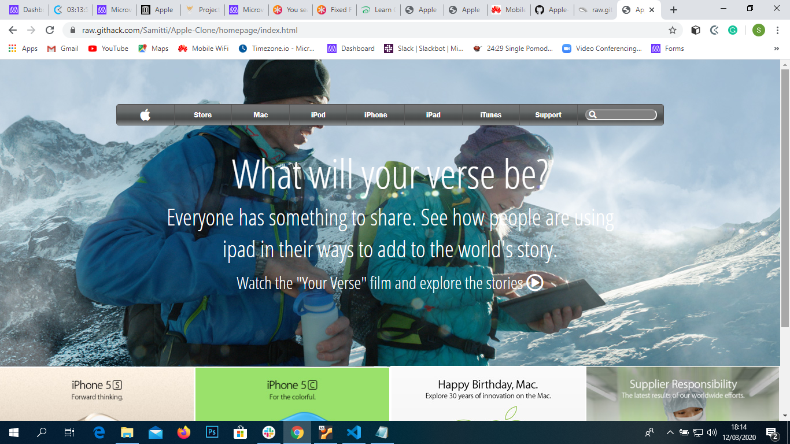

# Apple-Clone

This is an apple web clone project on a concept using background images and gradients.

Screenshot of Page

 

## Built With

- Html,
- Css
- Flexbox

[Live Demo Link](https://raw.githack.com/Samitti/Apple-Clone/homepage/index.html)

## About
An Example Repo for microverse Projects path as a mockup of [Old Apple Page](https://web.archive.org/web/20140301004610/http://www.apple.com/). 

It contains an exact copy of the layout, and similar functionality and the same user experience.

## Author

👤 **Samuel Teweldebrhan Ghebremeskel**

- Github: [@githubhandle](https://github.com/Samitti)
- Twitter: [@twitterhandle](https://twitter.com/Samuel63734232)
- Linkedin: [linkedin](https://www.linkedin.com/in/samuelghebremeskel/)

## 🤝 Contributing

Contributions, issues and feature requests are welcome!

Feel free to check the [issues page](https://github.com/Samitti/Apple-Clone/issues).

## Show your support

Give a ⭐️ if you like this project!

